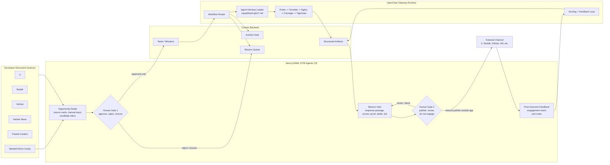
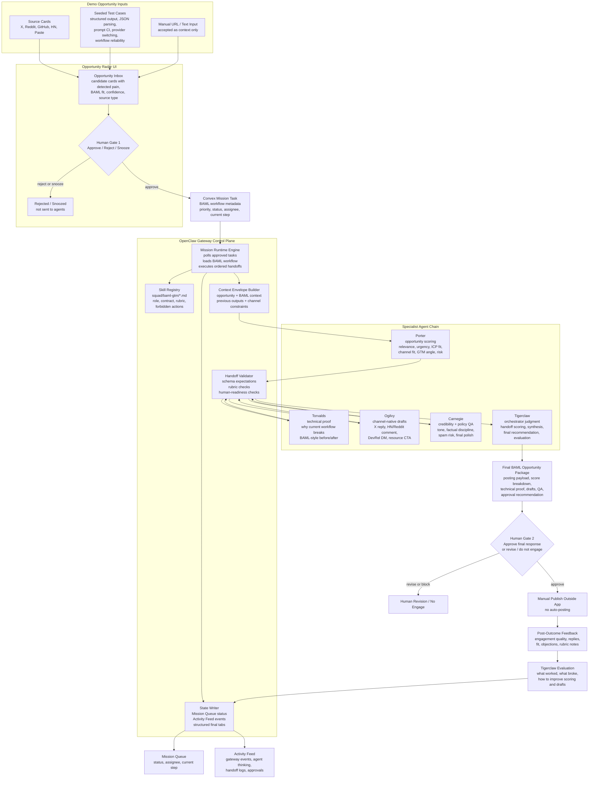
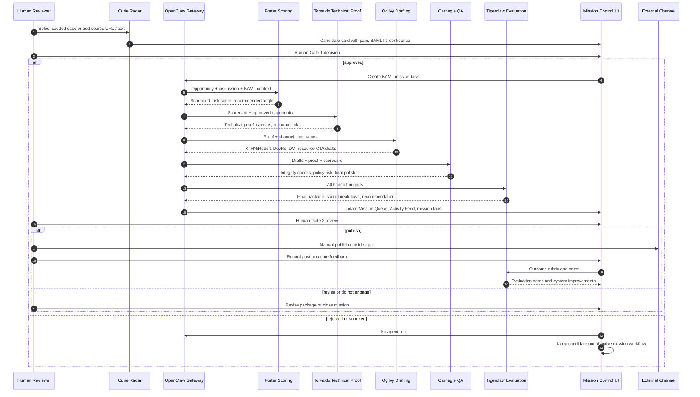

# BAML GTM Agentic OS

Agentic GTM OS demo for BAML / BoundaryML. It adapts the Mission Control scaffold into a developer opportunity radar: find BAML-fit developer complaints, approve the best moments, and generate a technical response package for human review.

**Prototype demo:** https://baml-gtm-agentic-os.vercel.app/

## GTM Objective

BAML needs to find moments where developers are already complaining about structured outputs, brittle JSON parsing, prompt testing, provider switching, or AI workflow reliability, then respond with useful technical proof instead of generic marketing.

This app turns that into a human-gated agent workflow:

1. A developer conversation is entered through a source card or selected from seeded demo cases.
2. The GTM or DevRel human approves only the opportunities that look relevant.
3. OpenClaw Gateway runs the specialist agents and records every handoff.
4. Tigerclaw synthesizes a final response package for human review.
5. The human manually publishes outside the app and later records outcome feedback.
6. Tigerclaw evaluates the outcome so the system can improve future scoring and copy.

## High-Level Architecture

At the highest level, the app is a human-gated GTM workflow. The UI collects or selects developer-discussion opportunities, Convex stores the mission state, OpenClaw Gateway manages the agent runtime, and the final artifact is a manually publishable BAML response package.



## OpenClaw Gateway System Diagram

OpenClaw Gateway is the runtime engine and control plane. It owns mission state, agent routing, handoff order, logging, final package assembly, and human review boundaries. The agents do specialized work; the gateway decides when each agent runs, what context it receives, where the output is stored, and whether the mission is ready for the next stage.

<details>
<summary>Comprehensive OpenClaw Gateway control-plane diagram</summary>

This deeper diagram expands the gateway internals: how approved opportunities become Convex mission tasks, how skill files become agent harnesses, how handoff validation works, and how Mission Queue / Activity Feed stay in sync.



</details>

## Agent Swimlane Diagram

This view shows the same workflow as swimlanes: each lane owns one stage of the GTM mission, and OpenClaw Gateway carries the context forward while enforcing human gates.



### Runtime Modes

The same UX supports two execution modes:

- **Hosted demo mode:** `NEXT_PUBLIC_HOSTED_DEMO=true`. Approval creates a completed BAML mission package immediately through `lib/bamlGtmPackage.ts` and `convex/tasks.ts`. This is the reviewer-safe path for Vercel because it does not require a local daemon, ChatGPT auth, OpenAI keys, live scraping, or auto-posting.
- **Local gateway mode:** `NEXT_PUBLIC_HOSTED_DEMO=false` or unset. Approval creates a real queued task. `gateway/index.ts` runs OpenClaw Gateway locally and executes the BAML workflow through Porter, Torvalds, Ogilvy, Carnegie, and Tigerclaw.

## Agent Harnesses

Each BAML GTM agent has a dedicated skill file under `squad/baml-gtm/`. These files are the harnesses used by OpenClaw Gateway: they define the agent role, input contract, output contract, evaluation criteria, forbidden actions, and handoff expectations.

### OpenClaw Gateway

OpenClaw Gateway is not a copywriting agent. It is the mission runtime engine.

- **Role:** Manage the full BAML GTM mission lifecycle after Human Gate 1 approval.
- **Allowed access:** Convex task state, Activity Feed logging, Mission Queue updates, BAML workflow metadata, agent skill files, prior handoff outputs, hosted demo package generator, and local LLM provider when running in local gateway mode.
- **Input contract:** Approved opportunity candidate with source type, source label, discussion text, detected pain, BAML relevance rationale, and confidence score.
- **Output contract:** A mission with structured tabs: Posting Payload, Opportunity, Technical Proof, Response Drafts, QA, Agent Harness, and Evaluation.
- **Evaluation criteria:** Every handoff must be traceable, BAML-relevant, schema-compatible, useful to a human reviewer, and conservative about publishing risk.
- **Forbidden actions:** No live scraping in demo mode, no auto-posting, no bypassing human review, no pretending seeded inputs are live platform data.
- **Handoff rule:** Gateway sends only approved opportunities into the active chain and records each transition in Mission Queue and Activity Feed.

### Curie: Opportunity Radar

Curie is represented by seeded test cases and manual discussion inputs in this demo.

- **Skill file:** `squad/baml-gtm/curie.md`
- **Role:** Convert raw developer discussion into a BAML opportunity candidate.
- **Allowed access:** Seeded demo cases, manual URL/text input, source type, and approved BAML context. No platform APIs.
- **Input contract:** Discussion text, source label, source type, and BAML context.
- **Output contract:** Candidate card with source, summary, detected pain, why BAML might be relevant, confidence score, and recommended approval action.
- **Evaluation criteria:** Pain must be specific, match the objective categories, avoid forced relevance, and make human approval fast.
- **Forbidden actions:** No live scraping, no private user inference, no auto-posting recommendation.
- **Handoff rule:** Curie stops at candidate creation. Human Gate 1 decides whether OpenClaw Gateway receives the mission.

### Porter: Opportunity Scoring

Porter decides whether the approved discussion is worth engaging with.

- **Skill file:** `squad/baml-gtm/porter.md`
- **Role:** Score BAML relevance, urgency, ICP fit, channel fit, GTM angle, and spam/policy risk.
- **Allowed access:** Approved opportunity, discussion text, detected pain, BAML relevance note, and BAML context pack.
- **Input contract:** One approved candidate plus source/discussion metadata.
- **Output contract:** Markdown scorecard with conversation summary, developer pain, BAML relevance, ICP fit, channel fit, opportunity score, risk score, recommended angle, and `publish`, `revise`, or `do not engage`.
- **Evaluation criteria:** Specific scoring, conservative weak-fit handling, developer-useful GTM angle, and explicit spam-risk accounting.
- **Forbidden actions:** No invented engagement data, no claims that live scraping happened, no recommendation just because BAML can be mentioned.
- **Handoff rule:** Porter passes the scorecard and recommended angle to Torvalds so the technical proof is grounded in the actual pain.

### Torvalds: Technical Proof

Torvalds makes the response credible by showing how BAML addresses the developer's technical pain.

- **Skill file:** `squad/baml-gtm/torvalds.md`
- **Role:** Build the technical proof behind the GTM response.
- **Allowed access:** Approved opportunity, Porter scorecard, BAML context, and recommended resource targets.
- **Input contract:** Candidate, scorecard, BAML context pack.
- **Output contract:** Markdown proof with current workflow pain, why it breaks, BAML-style before/after, practical caveats, and recommended resource.
- **Evaluation criteria:** Directly answers the complaint, uses concise credible snippets, stays inside known BAML claims, and avoids fake benchmarks.
- **Forbidden actions:** No claim that BAML was executed live, no invented performance data, no framing BAML as a full agent framework when the pain is structured-output reliability.
- **Handoff rule:** Torvalds passes proof and caveats to Ogilvy so drafts lead with substance instead of product marketing.

### Ogilvy: Response Drafting

Ogilvy turns proof into channel-native copy that a DevRel or GTM human can edit.

- **Skill file:** `squad/baml-gtm/ogilvy.md`
- **Role:** Draft useful responses for X, HN/Reddit, DevRel DM, and resource CTA.
- **Allowed access:** Approved opportunity, Porter scorecard, Torvalds proof, source type, and channel constraints.
- **Input contract:** Opportunity, scorecard, technical proof, and desired channel formats.
- **Output contract:** One fenced JSON block containing drafts for X Reply, HN / Reddit Comment, DevRel DM, and Resource CTA.
- **Evaluation criteria:** Helpful before promotional, developer-native, source-aware, concise, and not automated-sounding.
- **Forbidden actions:** No hype, no bulk-outreach language, no claims of scraping, no publishing approval.
- **Handoff rule:** Ogilvy passes draft options to Carnegie for credibility, factual discipline, and spam-risk review.

### Carnegie: Credibility And Policy QA

Carnegie protects the brand and the channel by checking whether the drafts are credible enough to show a developer.

- **Skill file:** `squad/baml-gtm/carnegie.md`
- **Role:** Review relevance, developer tone, policy/spam risk, and factual discipline.
- **Allowed access:** Ogilvy drafts, Torvalds proof, Porter scorecard, opportunity context, and known BAML constraints.
- **Input contract:** Drafts plus all previous handoff outputs.
- **Output contract:** One fenced JSON block with integrity checks, edit notes, final polish, and finalized draft payload.
- **Evaluation criteria:** Conservative recommendation, explicit risks, useful caveats, human-reviewable final post, and unsupported claims removed.
- **Forbidden actions:** No auto-post approval, no hidden commercial interest, no removing caveats just to make copy punchier.
- **Handoff rule:** Carnegie sends the safest final draft and QA notes to Tigerclaw for synthesis.

### Tigerclaw: Orchestrator And Evaluator

Tigerclaw is the judgment layer inside OpenClaw Gateway.

- **Skill file:** `squad/baml-gtm/tigerclaw.md`
- **Role:** Score handoffs, synthesize the final package, and evaluate post-outcome feedback.
- **Allowed access:** Approved opportunity, Porter scorecard, Torvalds proof, Ogilvy drafts, Carnegie QA, and post-outcome feedback.
- **Input contract:** All agent outputs plus optional outcome feedback.
- **Output contract:** Final package with recommended response, resource link, score breakdown, risk score, final opportunity score, approval recommendation, strongest artifact, highest risk, what worked, what broke, and improvements.
- **Evaluation criteria:** Human-useful package, traceable workflow, credible proof, clear approve/revise/block recommendation, and no spam behavior.
- **Forbidden actions:** No external publishing, no bypassing human approval, no pretending demo inputs came from live scraping.
- **Handoff rule:** Tigerclaw produces the final artifact for Human Gate 2 and later consumes outcome feedback for system evaluation.

## Final Artifacts

Each approved opportunity produces:

- Conversation summary
- Developer pain point
- BAML relevance rationale
- Opportunity score and risk score
- Technical proof snippet
- Channel-native response drafts
- Recommended BAML resource link
- Approval recommendation: `publish`, `revise`, or `do not engage`
- Posting payload for manual publishing
- Post-outcome feedback rubric
- Final evaluation notes

## Kept
- Next.js dashboard shell
- Convex agents, tasks, activity, notifications, skills, memory, graph, RSS/scout primitives
- Gateway dispatcher, scheduler, Telegram bridge, and agent prompt files
- LinkedIn/scout content pipeline primitives, pending the target use-case decision

## Removed
- Hiring/job-board routes
- Application review routes
- Gmail hiring feedback setup
- Form-filler page, Chrome extension, and Porter form action
- Candidate, job, application, email signal, and optimization snapshot schema tables

## Local Run

```bash
npm install
npx convex dev --local --local-force-upgrade --typecheck disable
npm run dev -- --port 3001
```

The scaffold uses its own local Convex deployment name:

```text
local:local-swayamshah1000-mission_control_scaffold
```

## Free Hosted Demo

Use this mode for assignment reviewers. It does not require the local OpenClaw Gateway, ChatGPT auth, OpenAI keys, or live scraping.

Recommended free stack:

- Vercel Hobby for the Next.js app.
- Convex Free for the hosted backend.

The deployable demo path is:

```text
candidate -> human approval -> hosted OpenClaw Gateway simulation -> completed BAML opportunity package
```

Set these environment variables in Vercel after creating a hosted Convex deployment:

```text
CONVEX_DEPLOY_KEY=<your Convex production deploy key>
NEXT_PUBLIC_HOSTED_DEMO=true
```

This repo includes `vercel.json`, which sets the Vercel build command to:

```bash
npx convex deploy --cmd-url-env-var-name NEXT_PUBLIC_CONVEX_URL --cmd 'npm run build'
```

That command deploys the Convex backend first, injects `NEXT_PUBLIC_CONVEX_URL` for the Next.js build, then builds the frontend. If Vercel runs plain `npm run build`, the app will not have a Convex URL and the live UI will not work.

Recommended publish flow:

1. Push this project as its own GitHub repo.
2. Create a Convex project on the Free plan and deploy the Convex functions with `npx convex deploy`.
3. Import the GitHub repo into Vercel on the Hobby plan.
4. Add the Vercel environment variables above.
5. Deploy. The reviewer can approve a test opportunity and immediately open a completed BAML GTM mission package.

Keep `NEXT_PUBLIC_HOSTED_DEMO=true` for the public review link. This keeps the demo deterministic and prevents it from depending on a local process.

Local gateway mode still exists for the full runtime:

```text
candidate -> human approval -> OpenClaw Gateway -> Porter -> Torvalds -> Ogilvy -> Carnegie -> Tigerclaw
```

For local gateway mode, set `NEXT_PUBLIC_HOSTED_DEMO=false` or omit it, then run:

```bash
npm run gateway:dispatcher
```
