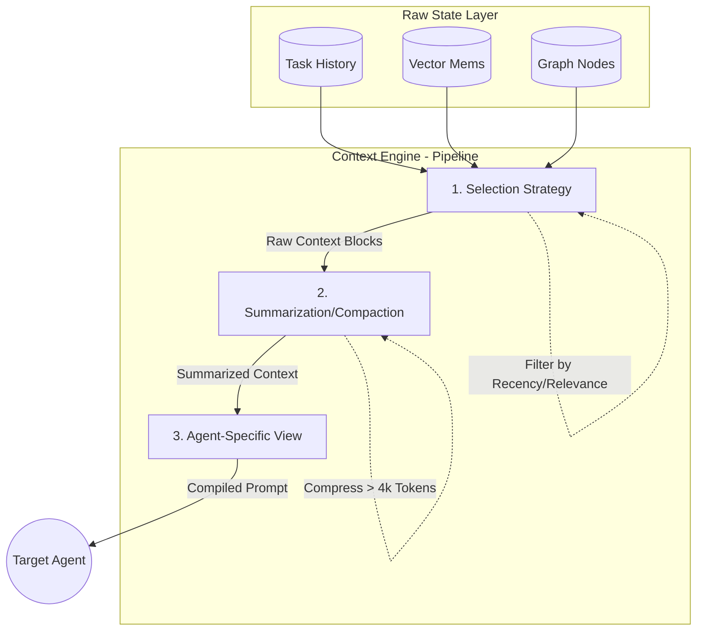
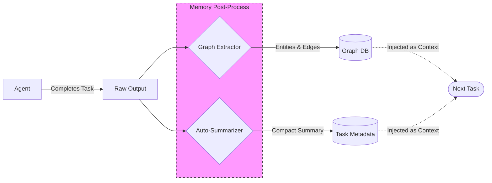

# Memory System Architecture: Recommendations & Future State

This document outlines the proposed evolution of the Mission Control memory system. It moves beyond simple logging and vector search to a fully **Context-Aware Engine** with lifecycle management and structured reasoning.

## 1. Core Structural Recommendations

### A. Implement a "Context Engine" Pipeline
**Problem:** Currently, context is a raw string concatenation. It grows legally until it hits token limits, and it's noisy.
**Solution:** Treat context as a *product* that passes through a pipeline before reaching the agent.
1.  **Selection:** Fetch raw rows (Tasks, Memories, Links).
2.  **Compaction:** Summarize older message turns using a cheaper model (e.g., `gemini-2.0-flash`).
3.  **Compilation:** Format specifically for the target agent (Visuals for Ive, Code for Torvalds).

### B. Activate GraphRAG (Structured Memory)
**Problem:** Vector search finds *similar* text but misses *connected* concepts (e.g., "Dependency relationships" or "Project hierarchies").
**Solution:**
1.  **Extraction:** When a task completes, specifically extract Entities (People, Tech, Companies) and Relationships.
2.  **Storage:** Populate the existing `graph_nodes` and `graph_edges` tables.
3.  **Traversal:** When querying, traverse edges to find 2nd-degree connections (e.g., "What other projects use *this* specific API key?").

### C. Artifact Lifecycle Management
**Problem:** Large files or datasets clutter the prompt.
**Solution:** Store large artifacts in a `resources` table. Pass only a *reference card* to the agent:
> *Resource: [System Logs](ID: 992) - 15MB - "Error logs from production"*
The agent can then requesting to "Read Resource 992" if needed, rather than forcing it into context.

---

## 2. Proposed Architecture Diagrams

### Diagram A: The Context Engine Pipeline
This flow shows how raw data is transformed into a "Compiled Context" for the agent.

### Diagram B: Automated Memory Curation Loop
This detailed view shows how *finished* work generates new memory (Graph + Summaries), closing the loop.

---

## 3. Implementation Plan (Phased)

### Phase 1: The "Librarian" Job (Async Curation)
*   Create a background function (scheduled or triggered on task completion).
*   **Job:** Takes the last completed task, generates a 2-sentence summary and 3 key tags.
*   **Benefit:** Immediate reduction in context noise for the *next* agent.

### Phase 2: Graph Injection
*   Update `searchMemories` in `gateway/index.ts`.
*   **Change:** Perform a vector search, identifying the top node. Then query `graph_edges` to pull in specific connected nodes.
*   **Benefit:** Agents "know" about relationships (e.g., "This task is blocked by Ticket #502").

### Phase 3: Dynamic Views
*   Refactor `services/llm.ts`.
*   Replace the hardcoded template with a `ViewFactory`.
*   **Example:** `Ive` gets a context rich in visual descriptions and image links. `Torvalds` gets a context rich in code snippets and file paths, stripping out marketing fluff.
