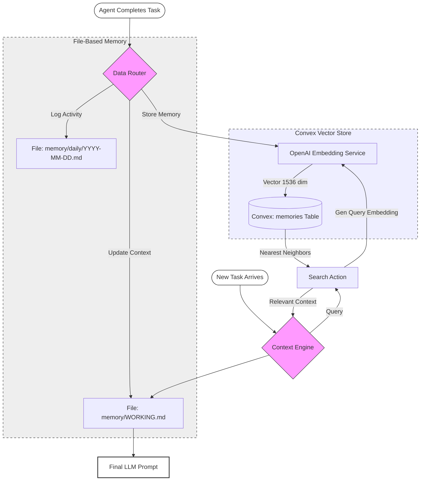

# Memory System Architecture

This flow diagram details the lifecycle of data within the Memory System, separating the **File-Based** logging from the **Vector-Based** long-term recall.

```mermaid
flowchart TD
    %% Key Input
    TaskComplete([Agent Completes Task]) --> DataSplit{Data Router}

    %% Branch 1: File-Based Logs (Audit Trail)
    subgraph FileSystem [File-Based Memory]
        direction TB
        %% Using quotes to avoid parse errors with colons and slashes
        DailyLog["File: memory/daily/YYYY-MM-DD.md"]
        WorkingMem["File: memory/WORKING.md"]
        
        DataSplit -->|Log Activity| DailyLog
        DataSplit -->|Update Context| WorkingMem
    end

    %% Branch 2: Vector Memory (Semantic Recall)
    subgraph VectorSystem [Convex Vector Store]
        direction TB
        DataSplit -->|Store Memory| EmbeddingProcess[OpenAI Embedding Service]
        EmbeddingProcess -->|Vector 1536 dim| DB[(Convex: memories Table)]
    end

    %% Retrieval Loop
    NewTask([New Task Arrives]) --> ContextEngine{Context Engine}
    
    %% RAG Process
    ContextEngine -->|Query| SearchOp[Search Action]
    SearchOp -->|Gen Query Embedding| EmbeddingProcess
    DB -->|Nearest Neighbors| SearchOp
    SearchOp -->|Relevant Context| ContextEngine
    
    %% Assembly
    ContextEngine --> WorkingMem
    WorkingMem --> FinalPrompt[Final LLM Prompt]

    %% Styling
    style TaskComplete fill:#fff,stroke:#333
    style NewTask fill:#fff,stroke:#333
    style DataSplit fill:#f9f,stroke:#333
    style FileSystem fill:#eee,stroke:#333,stroke-dasharray: 5 5
    style VectorSystem fill:#eef,stroke:#333,stroke-dasharray: 5 5
    style ContextEngine fill:#f9f,stroke:#333
    style FinalPrompt fill:#fff,stroke:#333,stroke-width:2px
```
