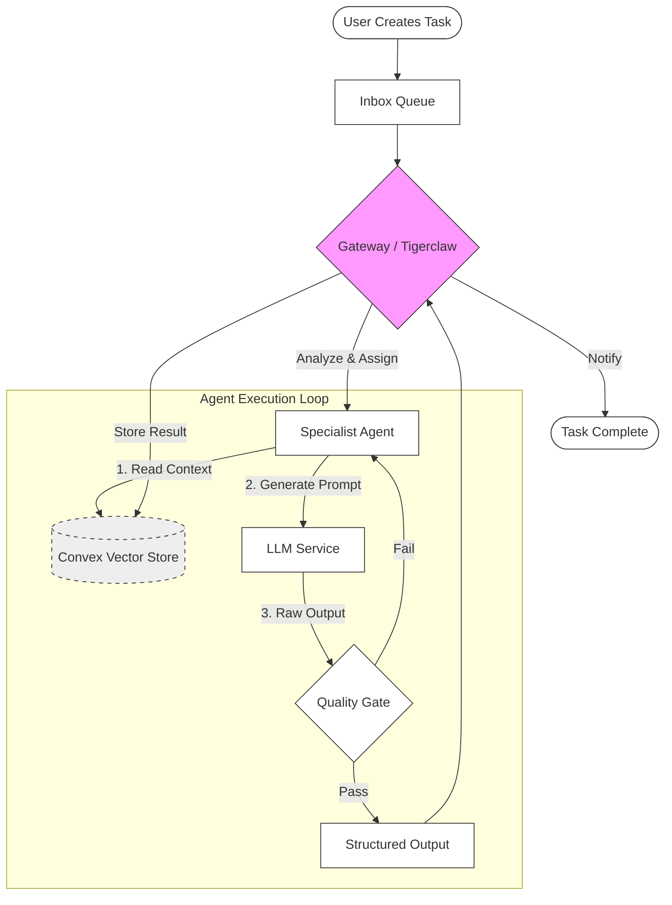

# Core Task Flow

This diagram shows the linear process of a single task moving through the system.

```mermaid
flowchart TD
    Start([User Creates Task]) --> Inbox[Inbox Queue]
    Inbox --> Gateway{Gateway / Tigerclaw}
    
    %% Decision / Assignment
    Gateway -->|Analyze & Assign| Agent[Specialist Agent]
    
    %% Execution Loop
    subgraph Execution [Agent Execution Loop]
        direction TB
        Agent -->|1. Read Context| Memory[(Convex Vector Store)]
        Agent -->|2. Generate Prompt| LLM[LLM Service]
        LLM -->|3. Raw Output| Validator{Quality Gate}
        
        Validator -- Fail --> Agent
        Validator -- Pass --> Result[Structured Output]
    end
    
    %% Completion
    Result --> Gateway
    Gateway -->|Store Result| Memory
    Gateway -->|Notify| User([Task Complete])

    %% Styling
    style Start fill:#fff,stroke:#333
    style Inbox fill:#fff,stroke:#333
    style Gateway fill:#f9f,stroke:#333
    style Agent fill:#fff,stroke:#333
    style Memory fill:#eee,stroke:#333,stroke-dasharray: 5 5
    style LLM fill:#fff,stroke:#333
    style Validator fill:#fff,stroke:#333
    style Result fill:#fff,stroke:#333
    style User fill:#fff,stroke:#333
```
